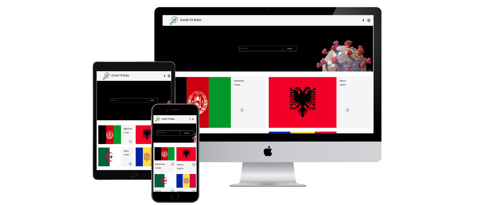

# Covid-19 Stats
<div align="center">>
  
  <br/>
  <h3> 🚀 <b>Covid-19 Stats</b></h3>

</div>

<!-- TABLE OF CONTENTS -->

# 📗 Table of Contents

- [📖 About the Project](#about-project)
  - [🛠 Built With](#built-with)
    - [Tech Stack](#tech-stack)
    - [Key Features](#key-features)
  - [🚀 Live Demo](#live-demo)
- [💻 Getting Started](#getting-started)
  - [Setup](#setup)
  - [Prerequisites](#prerequisites)
  - [Install](#install)
  - [Usage](#usage)
  - [Run tests](#run-tests)
  - [Deployment](#triangular_flag_on_post-deployment)
- [👥 Authors](#authors)
- [🔭 Future Features](#future-features)
- [🤝 Contributing](#contributing)
- [⭐️ Show your support](#support)
- [🙏 Acknowledgements](#acknowledgements)
- [❓ FAQ](#faq)
- [📝 License](#license)

# 📖 [Covid-19 Stats] <a name="react"></a>

> **A Covid-19 statistics app is a mobile application designed to provide up-to-date information on the number of confirmed cases, deaths, and recoveries from the Covid-19 pandemic from different countries around the world. The app can help users track the current situation of the pandemic in their country, and also provide information on the trends and patterns of the virus globally.**

## 🛠 Built With <a name="built-with">
HTML 5 , css3, javascript ES6, React , Redux and external API</a>

### Tech Stack <a name="tech-stack"></a>
- React, redux, axios, jest webpack and babel

<details>
  <ul>
    <li><a href="">linters</a></li>
    <li><a href="https://www.w3schools.com/html/">HTML</a></li>
    <li><a href="https://developer.mozilla.org/en-US/docs/Web/CSS">CSS</a></li>
    <li><a href="https://www.w3schools.com/js/default.asp">JS</a></li>
    <li><a href="https://github.com">GIT/Github</a></li>
    <li><a href="https://reactjs.org/docs/create-a-new-react-app.html#create-react-app">React JS</a></li>
  </ul>
</details>

### Key Features <a name="key-features"></a>

> **Filter the country of their choice**
> **Display App information from API**

<p align="right">(<a href="#readme-top">back to top</a>)</p>

## 🚀 Live Demo <a name="live-demo"></a>

-[Live Demo](https://www.loom.com/share/5fb7c791092a4418ac2ea9ae8bb3e5f5)

<p align="right">(<a href="#readme-top">back to top</a>)</p>

## Project Screenshots



## 💻 Getting Started <a name="getting-started"></a>

To get a local copy up and running, follow these steps.

### Prerequisites

In order to run this project you need:

```sh
- VSCode or any other IDE.
- node.js(preferable).
- browser to deploy.
- GitHub/Git.
```

### Setup

Clone this repository to your desired folder:

```sh
  cd my-folder
  git clone https://github.com/Rudy-Menekam/covid-19-stats.git
```

### Install

Install this project with:

```sh
  cd my-project
  npm init -y
```

-

### Usage

To run the project, execute the following command:

```sh
  npm install
  npm start
```

### Deployment

You can deploy this project using:

```sh
github pages
netlify
```

<p align="right">(<a href="#readme-top">back to top</a>)</p>

## 👥 Author <a name="author"></a>

👤 **Rudy Menekam**

- GitHub: [@githubhandle](https://github.com/Rudy-Menekam)
- Twitter: [@twitterhandle](https://twitter.com/MenekamR)
- LinkedIn: [linkedIn](https://www.linkedin.com/in/menekam-rudy/)

<p align="right">(<a href="#readme-top">back to top</a>)</p>

## 🔭 Future Features <a name="future-features"></a>

> **Include transitions and/or animations**
> **Implement additional pages in the website**

<p align="right">(<a href="#readme-top">back to top</a>)</p>

## 🤝 Contributing <a name="contributing"></a>

Contributions, issues, and feature requests are welcome!

Feel free to check the [issues page](https://github.com/Rudy-Menekam/covid-19-stats/issues).

<p align="right">(<a href="#readme-top">back to top</a>)</p>

## ⭐️ Show your support <a name="support"></a>

If you like this project, you are welcomed to star and fork it. You can also share your ideas for future features.

<p align="right">(<a href="#readme-top">back to top</a>)</p>

## 🙏 Acknowledgments <a name="acknowledgements"></a>

I would like to appreciate Microverse for providing the resources and the platform for us to be a Professional full-stack developer, and I would specially thank [Nelson Sakwa](https://www.behance.net/sakwadesignstudio) who is the original author of this [design](https://www.behance.net/gallery/31579789/Ballhead-App-(Free-PSDs))

<p align="right">(<a href="#readme-top">back to top</a>)</p>

## ❓ FAQ <a name="faq"></a>

- **[Do you need node installed to run this project?]**
  - [Yes]

<p align="right">(<a href="#readme-top">back to top</a>)</p>

## 📝 License <a name="license"></a>

This project is [MIT](./License.md) licensed.

<p align="right">(<a href="#readme-top">back to top</a>)</p>
